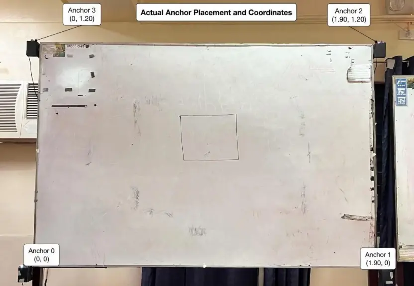
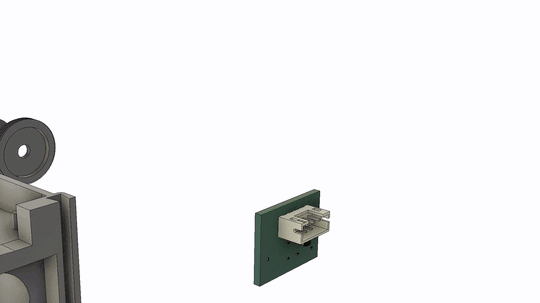

# PolyCast

**Turning an ordinary whiteboard marker into a digital pen - no special surface, no camera.**

The prototype uses a custom 3D-printed attachment fitted to a standard whiteboard marker.
Motion (IMU) and positioning (UWB) sensors track the marker across the board and send the
collected data wirelessly to a local server. The server processes the sensor data, reconstructs
the handwriting as digital strokes, and makes the result available through a web application for
live viewing and later download.

This is an undergraduate thesis project. The research contribution is the whole system
(hardware and software system) designed to digitize handwritten whiteboard lectures as
they arewritten. 

> **Status:** research prototype. It runs end-to-end on real hardware, but it
> expects the specific rig described below and is not a packaged product.

---

## How it works



Four UWB anchors sit at the corners of the target whiteboard. The pen ranges
against all four while its IMU supplies high-rate motion between UWB updates; an
**Error-State Kalman Filter** fuses the two, and a force sensor at the tip marks
pen-down/pen-up so strokes can be segmented and post-processed.

The pipeline's design, stage by stage, is documented in
**[`background/pipelines/README.md`](background/pipelines/README.md)** - start
there if you came for the sensor fusion work.

---

## Requirements

### Software

- **Python 3.11 or 3.12** - see the note below.
- Linux, macOS, or Windows for the server. Production target is a
  **Raspberry Pi 4B (ARM64)**.

> **Python 3.13 will not work.** The pinned `numpy==1.26.4` and `scipy==1.13.1`
> publish no 3.13 wheels, so pip tries to compile them from source and fails
> unless you have a full C/Fortran toolchain. If `python --version` says 3.13,
> use the **conda** path below - it installs a correct interpreter for you and
> does not touch your system Python.

### Hardware



The full live system needs the physical rig:

| Part | Qty | Notes |
| --- | --- | --- |
| ESP32 + DW3000 UWB module | 1 | the pen (transmitter) |
| DW3000 UWB anchors | 4 | mounted at whiteboard corners |
| IMU (accel + gyro) | 1 | in the pen |
| Force / pressure sensor | 1 | pen tip, for contact detection |
| ESP32 WROOM | 1 | serial bridge (receiver) |

**You do not need the hardware to explore the code.** Every pipeline stage can
be replayed offline against recorded data - see
[Running without hardware](#running-without-hardware).

---

## Quick start

```bash
git clone https://github.com/LEGENDFVRYz/polycast-thesis.git
cd polycast-thesis
```

Then pick **one** of the two setups below. Both end up in the same place.

<details open>
<summary><b>Option A - conda</b> (recommended: installs Python 3.12 for you)</summary>

Works the same on Windows, macOS and Linux, and does not care which Python is
already on your machine.

```bash
conda env create -f environment.yml
conda activate polycast
```

</details>

<details>
<summary><b>Option B - venv + pip</b> (needs Python 3.11 or 3.12 already installed)</summary>

First check your version:

```bash
python --version
```

If it reports 3.13 (or 3.10 and older), use Option A instead - or install
Python 3.12 from [python.org](https://www.python.org/downloads/) first.

**Windows (PowerShell):**

```powershell
py -3.12 -m venv .venv
.venv\Scripts\Activate.ps1
pip install -r requirements.txt
```

> `python3.12` is not a valid command on Windows - use the `py` launcher as
> shown. If PowerShell blocks the activate script, either run
> `.venv\Scripts\activate.bat` instead or allow scripts for this session with
> `Set-ExecutionPolicy -Scope Process RemoteSigned`.

**macOS / Linux:**

```bash
python3.12 -m venv .venv
source .venv/bin/activate
pip install -r requirements.txt
```

</details>

### Then, for either option

```bash
cp .env.example .env      # Windows PowerShell: Copy-Item .env.example .env
python _init_db.py        # create the SQLite schema
python main.py
```

Open <http://localhost:5050>.

To also run the pipeline self-tests and the live debug dashboard, install the
dev extras (conda's `environment.yml` already includes them):

```bash
pip install -r requirements-dev.txt
```

### Configuration

All settings live in `.env` (see `.env.example` for the annotated list). The two
that matter most:

```ini
SERIAL_PORT=COM3      # the ESP32 bridge. Linux/macOS: /dev/ttyUSB0
BAUD_RATE=921600
```

`SECRET_KEY` may stay blank in development - an ephemeral key is generated per
run. **When `APP_ENV=prod` the app refuses to start without one:**

```bash
python -c "import secrets; print(secrets.token_hex(32))"
```

---

## Choosing a fusion pipeline

Two pipelines ship side by side behind the same interface, selected with
`POLYCAST_PIPELINE`:

| Value | Path | Description |
| --- | --- | --- |
| `ekf` **(default)** | `background/pipeline_ekf/` | 6-state tightly-coupled EKF. The original, stable trace. |
| `eskf` | `background/pipelines/` | ESKF with per-stroke post-processing. The current research line. |

When `POLYCAST_PIPELINE=eskf`, `POLYCAST_MODE` additionally selects a
post-processing design without editing config:

| Mode | Behaviour |
| --- | --- |
| `fused` | UWB corrects continuously during ink |
| `imu-shape` | UWB anchors pen-down; IMU draws the stroke |
| `imu-shape+pp` | adds a two-point pen-up anchor |
| `imu-shape+pp2` | adds velocity detrend + trace filter |
| `imu-only` | UWB correction disabled (diagnostics) |

---

## Running without hardware

Every stage-owning module runs standalone against recorded data:

```bash
python -m background.pipelines.cleaner.unpacker
python -m background.pipelines.preprocess.imu
python -m background.pipelines.preprocess.uwb.range
python -m background.pipelines.fusion.eskf
python -m background.pipelines.reconstruct
python -m background.pipelines.visualizer        # live PyQtGraph dashboard
```

Outputs (CSVs and plots) land in `test/module_runs/` - see
[`test/module_runs/README.md`](test/module_runs/README.md) for how to read them.

> **Note:** recorded datasets are not committed (they are large, and `.gitignore`
> excludes `*.csv` / `*.npz`). Capture your own with `utils/serial_recorder.py`
> and replay them with `utils/serial_replayer.py`.

---

## Repository map

| Path | What it is |
| --- | --- |
| `main.py` | entry point - starts the WebSocket broadcaster + Flask server |
| `config.py` | environment-driven settings, single source of truth |
| `app/` | Flask app: routes, models, templates, static assets |
| `background/pipelines/` | **ESKF pipeline (legacy research line)** - [docs](background/pipelines/README.md) |
| `background/pipeline_ekf/` | **6-state EKF pipeline (default research line)** |
| `background/image_generator.py` | PIL canvas the MJPEG stream renders from |
| `_sketch/` | ESP32 firmware (pen, anchors, serial bridge) |
| `test/` | batch runs and parameter tuning |
| `utils/` | serial recorder / replayer |
| `docs/` | nginx + systemd deployment configs |
| `seed/` | database seeding scripts |

---

## Firmware

Sketches are in [`_sketch/`](_sketch/). Flash `tx_proto/` (data transmitter) to the pen and
`rx_proto/` (data reciever) to the serial bridge.

The firmware depends on libraries you install through the Arduino IDE /
PlatformIO - they are **not** vendored here and remain under their own licenses:
the **DW3000 driver** (`dw3000.h`), **ESPAsyncWebServer**, **AsyncTCP**, and the
**Arduino core for ESP32**.

---

## Deployment

`docs/` contains a production setup for a Raspberry Pi behind nginx:

- `docs/polycast.service` - systemd unit (gunicorn, `APP_ENV=prod`)
- `docs/nginx-polycast.conf` - reverse proxy; buffering is disabled for the
  MJPEG and SSE endpoints, which is mandatory for both to work

`gunicorn.conf.py` pins **`workers = 1`** deliberately: the PIL canvas and status
manager are in-process singletons, so forking would split them across memory
spaces. Concurrency comes from the 16-thread `gthread` pool.

Both files assume the repo lives at `/home/polycastadmin/esp32_mock_webserver`;
adjust the paths for your host.

---

## Authors

| Name                               | Role                                                 |
| ---------------------------------- | ---------------------------------------------------- |
| **Sebastien Louis Cruz**           | Technical Lead & Full Stack Engineer                 |
| **Christian April Kim Villanueva** | First Author & Data/Backend Engineer                 |
| **Christian Espanol**              | Project Manager (Leader) & Frontend Developer        |
| **Timothy Castillo**               | CAD Engineer & Frontend Developer                    |


## License

[MIT](LICENSE). Third-party firmware dependencies remain under their own
licenses - see the LICENSE file.
